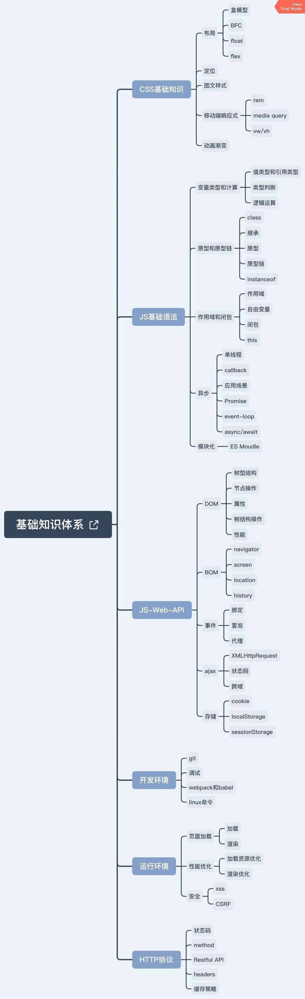

# 1.1 导学
## 前端面试中的重要考点

- HTML和CSS
- 原型、作用域、异步
- DOM事件和Ajax
- 性能优化
- 手写代码
- HTTP协议

## 如何做到“最易了解”
- 讲知识点，不是题海战术
- 学会一道题，就能应对一类题
- 帮你构建初级前端知识体系

## 知识点介绍
### CSS
- 布局
- 定位
- 图文样式
- 移动端响应式
- 动画渐变

### ES语法
- 原型 原型链
- 作用域 闭包
- 异步 单线程

### Web API
- DOM BOM
- Ajax 跨域
- 事件 存储

### 开发环境
- 版本管理
- 调试捉包
- 打包构建

### 运行环境
- 页面渲染
- 性能优化
- Web 安全

### 网络通讯
- headers
- Restful API
- 缓存策略

## 如何做到"匹配大厂"?
- 大厂偏爱考察基础

# 1.2 怎么准备面试
## 关于面试

- 基础工程师：基础知识
- 高级工程师：基础知识 + 项目经验
- 架构师：解决方案能力

## 关于基础

- 工程师的自我修养：基础知识
- 扎实的基础能让你高效学习新技术

# 1.3 面试题体验
## 几个面试题
- 出题
- 思考
### 思考
- 拿到一个面试题，你第一时间看到的是什么？
【考点】

- 如何看待网上搜出来的永远做不完的题海？
【不变应万变（题可变，考点不变）】

- 如何对待接下来遇到的面试题？
【题目到知识点，再到题目】

#### typeof 能判断哪些类型？
考点：JS变量类型

#### 何时使用 === 何时使用 == ？
考点：强制类型转换

#### window.onload 和 DOMContentLoaded 的区别？
考点：页面加载过程

#### JS创建10个<a>标签，点击的时候弹出对应的序号
考点：JS作用域

#### 手写节流 throttle、防抖 debounce
考点：性能、体验优化

#### Promise 解决了什么问题？
考点：JS异步

# 1.4 如何搞掂所有面试题
- 题目考察的知识点，再拓展思考

# 1.5 前端知识体系
### 什么是知识体系?
- 高效学习三部曲：找准知识体系；刻意训练；及时反馈；
- 知识体系：结构化的知识范围
- 涵盖所有知识点；结构化、有组织、易拓展

### 从哪方面梳理
- W3C标准
- ECMA 262 标准
- 开发环境
- 运行环境

### 知识体系目录
- CSS 基础知识
- JS 基础语法
- JS-Web-API
- 开发环境
- 运行环境
- HTTP协议

