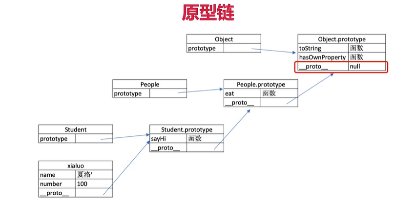
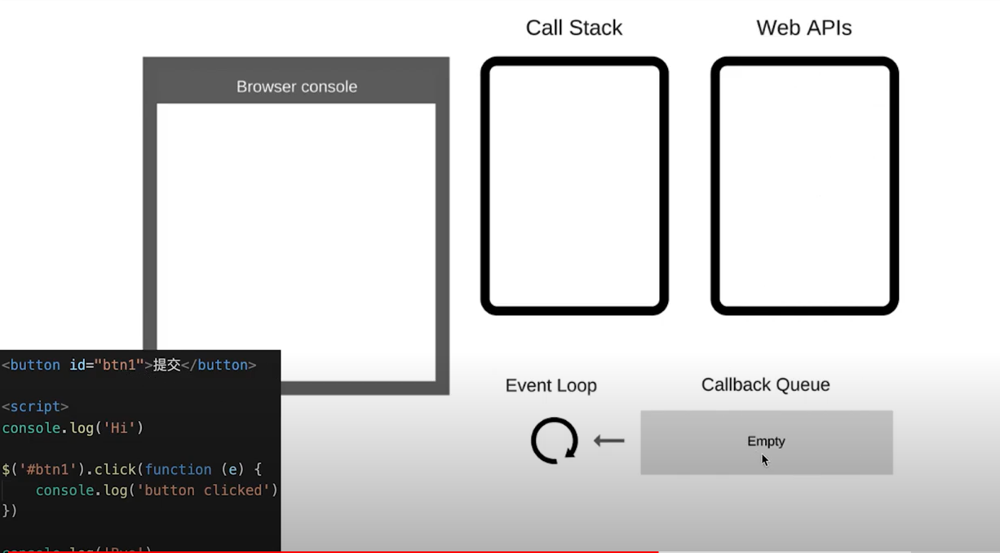
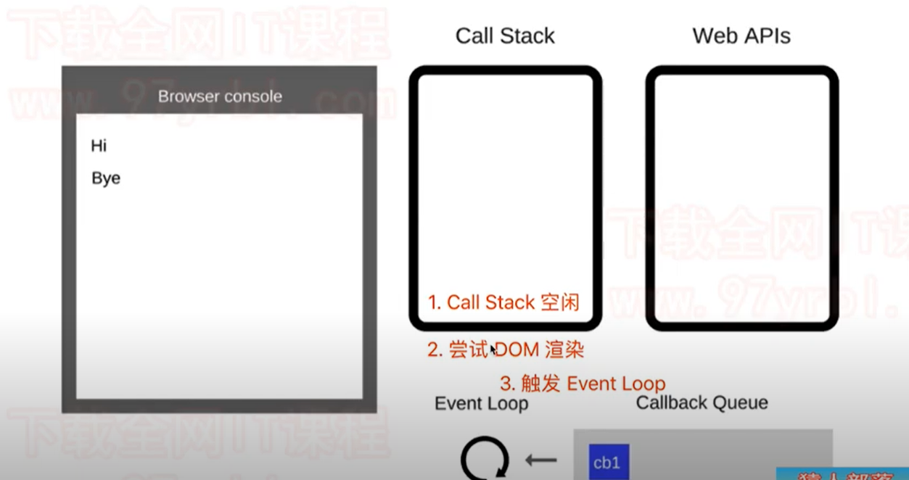
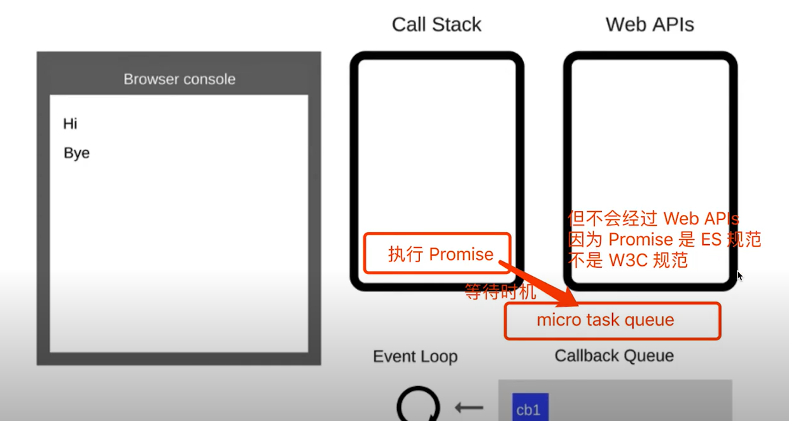
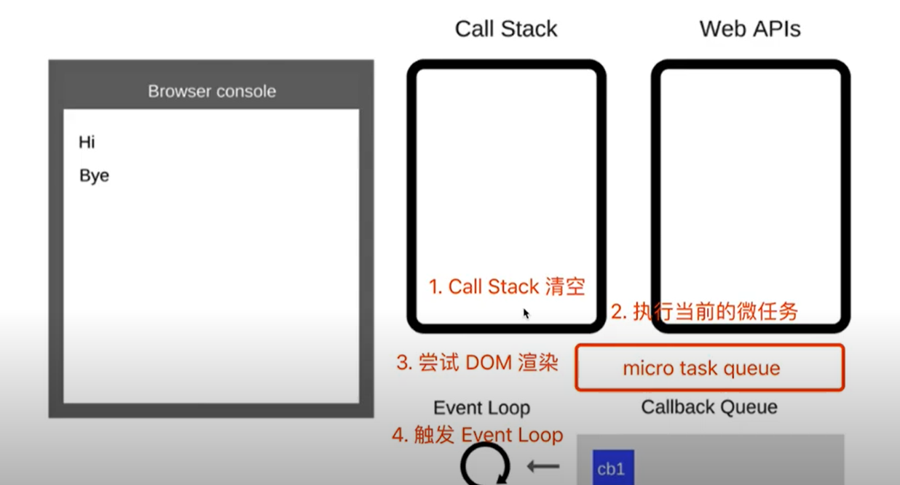

# JS 基础

## 变量类型和计算

### 题目

- typeof 能判断哪些类型？

- 何时使用 === 何时使用 ==？

- 值类型和引用类型的区别？

- 手写深拷贝？

### 知识点

####  变量类型

##### 值类型 vs 引用类型(堆栈模型)
```javascript
// 值类型：在栈中存储
let a = 100
let b = a
a = 200
console.log(b) // 100

// 引用类型：在栈中存储的是堆的内存地址
let c = { age: 20 }
let d = c
d.age = 21
console.log(c.age) // 21

// 常见的值类型
let a // undefined
const s = 'abc'
const n = 100
const b = true
const z = Symbol('z')

// 常见引用类型
const obj = { x: 100 }
const arr = ['a', 'b', 'c']
const n = null // null：特殊引用类型，指针指向了空地址
// 函数：特殊引用类型，但不用于存储数据，所有没有“拷贝、复制函数”这一说
function fn() {}
```

##### typeof运算符
- 识别所有值类型
```javascript
let a;                   typeof a   // 'undefined'
const str = 'abc';       typeof str // 'string'
const n = 100;           typeof n   // 'number'
const b = true;          typeof b   // 'boolean'
const z = Symbol('z');   typeof z   // 'symbol'
```

- 识别函数
```javascript
typeof console.log       // 'function'
typeof function() {}     // 'function'
```

- 判断是否是引用类型(不可再细分)
```javascript
typeof null              // 'object'
typeof ['b','b']         // 'object'
typeof { x: 10 }         // 'object'

```

##### 深拷贝
> js-demo/deepClone.js
- 注意判断值类型和引用类型
- 注意判断是数组还是对象
- 递归

#### 变量计算-类型转换
```javascript
// 字符串拼接
const a = 100 + 10    // 110
const b = 100 + '10'  // '11010'
const c = true + '10' // 'true10'

// == 运算符
100 == '100'  // true
0 == ''       // true
0 == false    // true
fales == ''   // true
null == undefined // true

// 除了 == null 之外，其他都一律使用 === ，例如：
const obj = {x: 100}
if(obj.a == null) {}
// 相当于
// if(obj.a === null || obj.a === undefined) {}
```

- if语句和逻辑判断
```javascript
// truly变量： !!a === true 的变量
// falsely变量：!!a === false 的变量

// 以下是 falsely 变量。除此之外都是 truly 变量
!!0 === false
!!NaN === false
!!'' === false
!!null === false
!!undefined === false
!!false === false

// 逻辑判断
console.log(10 && 0) // 0
console.log('' || 'abc') // 'abc'
console.log(!window.abc) // true
```

## 原型和原型链

### 题目

- 如何准确判断一个变量是不是数组？
a instanceof Array

- 手写一个简易的JQuery，考虑插件和拓展性
> js-demo/jquery-demo.js

- class的原型本质，怎么理解？
原型和原型链的图示；属性和方法的执行规则

### 知识点

#### class 和继承

##### class
- constructor
- 属性
- 方法

```javascript
class Student {
    constructor(name, number) {
        this.name = name
        this.number = number
    }
    sayHi() {
        console.log(`姓名：${this.name}，学号：${this.number}`)
    }
}

// 通过类声明对象/实例
const xialuo = new Student('夏洛',100)
console.log(xialuo.name)
console.log(xialuo.number)
console.log(xialuo.sayHi())
```

##### 继承
- extends
- super
```javascript
// 父类
class People {
    constructor(name) {
        this.name = name
    }
    eat() {
        console.log(`${this.name} eat something`)
    }
}

class Student extends People {
    constructor(name, number){
        super(name)
        this.number = number
    }
    sayHi() {
        console.log(`姓名：${this.name}，学号：${this.number}`)
    }
}

class Teacher extends People {
    constructor(name, major){
        super(name)
        this.major = major
    }
    teach() {
        console.log(`${this.name} 教授 ${this.major}`)
    }
}
```

#### 类型判断instanceof
```javascript
xialuo instanceof Student  // true
xialuo instanceof People   // true
xialuo instanceof Object   // true

[] instanceof Array        // true
[] instanceof Object       // true

{} instanceof Object       // true
```

#### 原型和原型链
##### 原型
```javascript
// class 实际上是函数，就是语法糖
typeof People  // 'function'
typeof Student // 'function'

// 隐式原型和显式原型
console.log(xialuo.__proto__) // 隐式原型
console.log(Student.prototype) // 显式原型
console.log(xialuo.__proto__ === Student.prototype) // true
```
- 每个class都有显式原型 prototype
- 每个实例都有隐式原型 __proto__
- 实例的 __proto__ 指向对应 class（类） 的prototype

##### 基于原型的执行规则
- 获取属性xialuo.nane 或执行方法xialuo.sayHi()时
- 先在自身属性和方法寻找
- 如果找不到则自动去 __proto__ 中查找

##### 原型链
```javascript
console.log(Student.prototype.__proto__)
console.log(People.prototype)
console.log(Student.prototype.__proto__ === People.prototype) // true

xialuo.hasOwnProperty('name') // true
xialuo.hasOwnProperty('eat')  // false
```

##### instanceof 是基于原型链实现的

## 作用域和闭包

### 题目
- this 
> js-demo/this.js

- 手写 bind 函数
> js-demo/bind-demo.js

- 实际开发中闭包的应用场景，举例说明
隐藏数据：如做一个简单的cache工具 (cache-demo.js)

### 知识点
#### 作用域和自由变量
##### 作用域
- 全局作用域
- 函数作用域
- 块状作用域（ES6新增）
```javascript
if(true) {
    let x = 100
}
 console.log(x) // 报错
```
##### 自由变量
- 一个变量在当前作用域没有定义，但被使用了
- 向上级作用域，一层一层一次寻找，直至找到为止
- 如果到全局作用域都没有找到，则报错 xx is not defined

#### 闭包
> js-demo/closure.js
闭包：自由变量的查找，是在函数定义的地方，向上级作用域查找；不是在执行的地方!!

#### this场景 (是在函数执行的时候确定的)
> js-demo/this.js
- 作为普通函数
- 使用call apply bind
- 作为对象方法被调用
- 在class方法中调用
- 箭头函数( this取上级作用域的值 )


## 异步和单线程
### 题目
- 同步和异步的区别是什么？

- 手写用Promise加载一张图片
> js-demo/promise-demo.js

- 前端使用异步的场景有哪些？

- setTimeout 笔试题
```javascript
console.log(1)
setTimeout(function(){
    console.log(2)
}, 1000)
console.log(3)
setTimeout(function() {
    console.log(4)
},0)
console.log(5)
// 1 3 5 4 2
```

### 知识点
#### 单线程和异步
- JS 是单线程语言，只能同时做一件事儿
- 浏览器和nodejs已支持js启动进程，如Web Worker
- JS 和 DOM渲染共用同一个进程，因为JS可修改DOM结构
- 遇到等待（网络请求，定时任务）不能卡住
- 需要异步
- 回调callback函数形式

#### 异步和同步区别
- 基于JS是单线程语言
- 异步不会阻塞代码执行
- 同步会阻塞代码执行

#### 应用场景
- 网络请求，如ajax，图片加载
- 定时任务，如setTimeout，setInterval

#### callback hell（回调地狱） 和 Promise
> promise-demo.js
```javascript
function getData(url) {
    return new Promise((resolve, reject) => {
        $.ajax({
            url,
            success(data) {
                resolve(data)
            },
            error(err) {
                reject(err)
            }
        })
    })
}
const url1 = '/data1.json'
const url2 = '/data2.json'
const url3 = '/data3.json'
getData(url1).then(data1 => {
    console.log(data1)
    return getData(url2)
}).then(data2 => {
    console.log(data2)
    return getData(url3)
}).then(data3 => {
    console.log(data3)
}).catch(err => console.error(err))
```

## JS异步-进阶

### 题目
- 请描述event loop（事件循环/事件轮询）的机制，可画图

- 什么是宏任务和微任务，两者有什么区别？

- Promise有哪三种状态？如何变化？

- 场景题：promise then和catch 的连接

```javascript
// 第一题
Promise.resolve().then(()=> {
    console.log(1)
}).catch(()=>{
    console.log(2)
}).then(()=> {
    console.log(3)
})

// 第二题
Promise.resolve().then(()=> {
    console.log(1)
    throw new Error('error1')
}).catch(()=>{
    console.log(2)
}).then(()=> {
    console.log(3)
})

// 第三题
Promise.resolve().then(()=> {
    console.log(1)
    throw new Error('error1')
}).catch(()=>{
    console.log(2)
}).catch(()=> {
    console.log(3)
})
```

- 场景题：async/await 语法
```javascript
async function fn() {
    return 100
}
(async function(){
    const a = fn()
    console.log('a', a)
    const b = await fn()
    console.log('b', b)
})()

(async function(){
    console.log('start')
    const a = await 100
    console.log('a', a)
    const b = await Promise.resolve(200)
    console.log('b', b)
    const c = await Promise.reject(300)
    console.log('c', c)
    console.log('end')
})()
```

- 场景题-promoise和setTimeout的顺序
```javascript
console.log(100)
setTimeout(()=> {
    console.log(200)
})
Promise.resolve().then(()=> {
    console.log(300)
})
console.log(400)
```

- 场景题-外加async/await的顺序问题
```javascript
async function async1() {
    console.log('async1 start')
    await async2()
    console.log('async1 end')
}
async function async2() {
    console.log('async2 start')
}
console.log('script start')
setTimeout(()=> {
    console.log('setTimeout')
},0)
async1()

new Promise(function(resolve) {
    console.log('promise1')
    resolve()
}).then(function() {
    console.log('promise2')
})

console.log('script end')
```

### 知识点

#### event loop（事件循环/事件轮询）
- JS是单线程运行的
- 异步要基于回调来实现的
- event loop 就是异步回调的实现原理

##### JS如何执行？
- 从前到后，一行一行执行
- 如果某一行执行报错，则停止下面代码的执行
- 先把同步代码执行完，再执行异步

##### 示例
```javascript
console.log('Hi')
setTimeout(function cb1() {
    console.log('cb1') // cb 即callback
}, 5000)
console.log('Bye')
```

##### event loop 的执行过程
- 同步代码，一行一行放在`Call Stack`执行
- 遇到异步，会先“记录”下，等待时间（定时、网络请求等）
- 时机到了，就移动到`Callback Queue`
- 如`Call Stack` 为空（即同步代码执行完）`Event Loop` 开始工作
- 轮询查找 `Callback Queue`, 如有则移动到 `Call Stack`执行
- 然后继续轮询查找（永动机一样）





##### DOM事件 和event loop
- JS 是单线程
- 异步（setTimeout，ajax等）使用回调，基于event loop
- DOM事件也使用回调，基于event loop
```javascript
console.log('Hi')

$('#btn').click(function(e) {
    console.log('button clicked')
})

console.log('Bye')
```

#### promise 进阶
##### 三种状态
- pending resolved reject
- pending => resolved 或 pending => reject
- 变化不可逆

##### 状态的表现和变化
- pending 状态，不会触发then和catch
- resolved 状态，会触发后续的then回调函数
- reject 状态，会触发后续的catch回调函数

##### then和catch对状态的影响(重要)
> js-demo/promise4.js
- then 正常返回resolved, 里面有报错则返回rejected
- catch 正常返回resolved, 里面有报错则返回rejected

#### async/await
> js-demo/async1.js
- 异步回调 callback hell
- Promise then catch链式调用，但也是基于回调函数的
- async/await 是同步语法，彻底消灭了回调函数

##### async/await 和 Promise关系
> js-demo/async2.js
- async/await 是消灭异步回调的终极武器
- 但和Promise并不互斥
- 执行async函数，返回的是Promise对象
- await 相当于 Promise的then
- try...catch 可捕获异常，代替了Promise的catch

##### 异步本质
> js-demo/async3.js
- async/await 是消灭异步回调的终极武器
- JS还是单线程，还是得有异步，但还是基于event loop
- async/await 只是一个语法糖，但这颗糖真香！

##### for...of
> js-demo/for-of.js
- for...in（以及forEach for）常规的同步遍历
- for...of 常用于异步的遍历

#### 宏任务(macroTask)/微任务(microTask)
> js-demo/macro-micro.js
##### 什么是宏任务，什么是微任务
- 宏任务:setTimeout，setInterval，Ajax，Dom事件
- 微任务:Promise，async/await
- 【微任务执行时机比宏任务要早】

##### event loop 和DOM渲染
> js-demo/macro-micro2.js
- 再次回归event loop的过程
- JS是单线程的，而且和DOM渲染共用一个线程
- JS执行的时候，得留一些时机供DOM渲染
- 每次Call Stack清空（即每次轮询结束），即同步任务执行完
- 都是DOM重新渲染的机会，DOM结构如有改变则重新渲染
- 然后再去触发下一次Event loop

##### 两者区别
- 宏任务：DOM渲染后触发，如setTimeout
- 微任务：DOM渲染前触发，如Promise

##### 从Event Loop 解释，为什么微任务执行更早
- 微任务是ES6语法规定的
- 宏任务是由浏览器规定的
