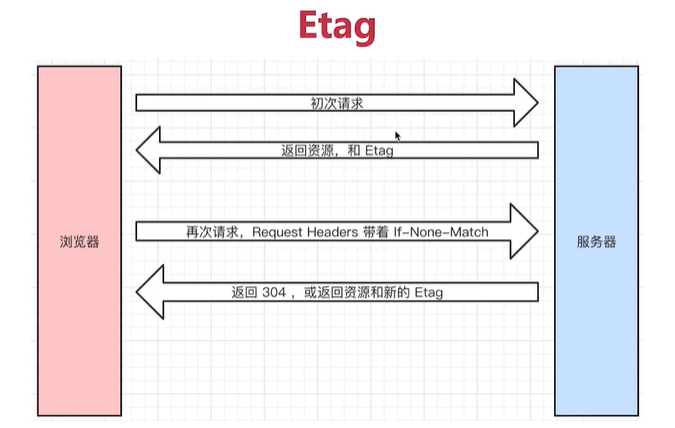

# JS Web API
> js-web-api

## 从JS基础知识到JS Web API
- JS基础知识，规定语法（ESMA 62 标准）
- JS Web API， 网页操作的API（W3C标准）
- 前者是后者的基础，两者结合才能真正实际应用

## DOM

### 前言
- vue和React框架应用广泛，封装了DOM操作
- 但DOM操作一直都是前端工程师的基础、必备知识
- 只会vue而不懂DOM操作的前端，不会长久

### 题目
- DOM是哪种数据结构
- DOM操作的常用API
- attr 和 property 的区别
- 一次性插入多个DOM节点，考虑性能

### 知识点
#### DOM 本质
- 一颗树(DOM 树)

#### DOM节点操作
- 获取DOM节点
> dom.html
```javascript
const div1 = document.getElementById('div1')
console.log(div1)

const divList = document.getElementsByTagName('div') // 集合
console.log('divList.length', divList.length)
console.log('divList[0]', divList[0])

const containerList = document.getElementsByClassName('container') // 集合
console.log('containerList', containerList)

const pList = document.querySelectorAll('p')
console.log('pList', pList)
```

- attribute
```javascript
const pList = document.querySelectorAll('p')
const p1 = pList[0]
p1.setAttribute('data-name', 'name')
console.log(p1.getAttribute('data-name'))
p1.setAttribute('style', 'font-size:20px')
```

- property 形式
```javascript
const pList = document.querySelectorAll('p')
const p1 = pList[0]

// property 形式
p1.style.width = '100px'
p1.className = 'red'
console.log(p1.style.width)
console.log(p1.className)
console.log(p1.nodeName)
console.log(p1.nodeType)
```

##### property 和 attribute
- property: 修改对象属性，不会体现到html结构中
- attribute: 修改html属性，会改变html结构
- 两者都有可能引起DOM重新渲染

#### DOM结构操作
> dom-2.js
- 新增/插入节点
- 获取子元素列表 ，获取父元素
- 删除子元素

#### DOM性能
- DOM 操作非常“昂贵”，避免频繁的DOM操作
- 对DOM查询做缓存
```javascript
// 不缓存 DOM 查询结果
for(let i = 0; i < document.getElementsByTagName('p').length; i++) {
    // 每次循环，都会计算 length，频繁进行 DOM 查询
}
// 缓存 DOM 查询结果
const pList = document.getElementsByTagName('p')
const length = pList.length
for(let i = 0; i < length; i++) {
    // 缓存 length，只进行一次 DOM 查询
}
```
- 将频繁操作改成一次性操作
> demo-3.js
```javascript
const listNode = document.getElementById('list')

// 创建一个文档片段，此时还没有插入到 DOM 树中
const frag = document.createDocumentFragment()

// 执行插入
for(let x = 0; x<10; x++>) {
    const li = document.createElement('li')
    li.innerHTML = "List item " + x
    frag.appendChild(li)
}

// 都完成之后，再插入到 DOM 树
listNode.appendChild(frag)
```

## BOM

### 题目
- 如何识别浏览器的类型
- 分析拆解url各个部分

### 知识点

#### navigator
```javascript
const ua = navigator.userAgent
const isChrome = ua.indexOf('Chrome')
console.log(isChrome)
```

#### screen
```javascript
console.log(screen.width)
console.log(screen.height)
```

#### location
```javascript
console.log(location.href)
console.log(location.protocol)
console.log(location.pathname)
console.log(location.search)
console.log(location.hash)
```

#### history
```javascript
history.back() // 后退
history.forward() // 前进
```

## 事件
> event.js
### 题目
#### 编写一个通用的事件监听函数
#### 描述事件冒泡的流程
- 基于DOM树形结构
- 事件会顺着触发元素往上冒泡
- 应用场景：代理

#### 无限下拉的图片列表，如何监听每个图片的点击？
- 事件代理
- 用 e.target 获取触发元素
- 用 matched 来判断是不是触发元素

### 知识点
#### 事件绑定
```javascript
const btn = document.getElementById('btn1')
btn.addEventListener('click', event => {
    console.log('clicked')
})

// 通用的绑定函数
function bindEvent(elem, type, fn) {
    elem.addEventListener(type, fn)
}
const a = document.getElementById('link1')
bindEvent(a, 'click', e=> {
    e.preventDefault() // 阻止默认行为
    alert('clicked')
})
```

#### 事件冒泡
```javascript
const p1 = document.getElementById('p1')
const body = document.body

bindEvent(p1, 'click', e => {
    console.log(e.target) // 获取触发的元素
    e.stopPropagation() // 注释掉这一行，来体会事件冒泡
    alert('激活')
})
bindEvent(body, 'click', e => {
    alert('取消')
})
```

#### 事件代理
```javascript
const div3 = document.getElementById('div3')
div3.addEventListener('click', e => {
    e.stopPropagation()
    const target = e.target
    if(target.nodeName === 'A') {
        alert(target.innerHTML)
    }
})
```
- 代码简洁
- 减少浏览器内存占用
- 但是，不要滥用

## ajax

### 题目
- 手写一个简易的 ajax
- 跨域的常用实现方法

### 知识点
#### XMLHttpRequest
> ajax.js 手写ajax

#### xhr.readyState
- 0-(未初始化)还没有调用send方法
- 1-(载入)已调用send方法，正在发送请求
- 2-(载入完成)send方法执行完成，已经接收到全部响应内容
- 3-(交互)正在解析响应内容
- 4-(完成)响应内容解析完成，可以在客户端调用

#### xhr.status
- 2xx - 表示成功处理请求，如200
- 3xx - 需要重定向，浏览器直接跳转，如301、302、304
- 4xx - 客户端请求错误，如404、403
- 5xx - 服务端报错

#### 跨域：同源策略，跨域解决方案
##### 什么是跨域（同源策略）
- ajax请求时，`浏览器`要求当前网页和server必须同源（安全）
- 同源：协议、域名、端口，三者必须一致
- 前端：https://a.com:8080/; server: https://b.com/api/xx （不同源）

##### 加载图片 css js可无视同源策略
- 
- <link src="跨域的css地址">
- <script src="跨域的js地址"></script>
- img 可用于统计打点，可使用第三方统计服务
- link script 可使用cdn，cdn一般是外域
- script 可实现 JSONP

##### 跨域
- 所有的跨域，都必须经过server端允许和配合
- 未经server端允许就实现的跨域，说明浏览器有漏洞，危险信号

##### JSONP
- 访问http://xx.com/，服务端一定返回一个html文件吗？
- 服务端可以任意动态拼接数据返回，只要符合html格式要求
- 同理于<script src="http://a.com/getData.js"></script>
- script 可以绕开跨域
- 服务器可以任意动态拼接数据返回
- 所以，script 可以获得跨域的数据，只要服务端愿意返回

##### JQuery 实现jsonp
```javascript
$.ajax({
    url: 'http://abc.com',
    dataType: 'jsonp',
    jsonpCallback: 'callback',
    success: function(data) {
        console.log(data)
    }
})
```

##### CORS（服务端支持）
- 服务器设置http header

### 常用的ajax插件
- JQuery
- fetch
- axios

## 存储

### 题目
####  描述cookie localStorage sessionStorage 区别
- 容量
- API 的易用性
- 是否跟随http请求发送出去

### cookie
- 本身用于浏览器和server通信
- 被“借用”到本地存储来
- 可用 document.cookie = '...' 修改

#### cookie 缺点
- 存储大小，最大4kb
- http 请求时需要发送到服务端，增加请求数据量
- 只能用 document.cookie = '...' 来修改，太过简陋

### localStorage 和 sessionStorage
- HTML5 专门为存储而设计，最大可存5M
- API 简单易用 setItem, getItem
- 不会随着http请求发送出去
- localStorage 数据会永久存储，除非代码或手动删除
- sessionStorage 数据只存在于当前会话，浏览器关闭则清空
- 一般用 localstorage 更多

## HTTP

### 题目
- HTTP 常见状态码有哪些？
- HTTP 常见的 header 有哪些？
- 什么是 Restful API
- 描述一下 http 的缓存机制`(重要)`

### 状态码
#### 状态码分类
- 1xx 服务器收到请求
- 2xx 请求成功，如200
- 3xx 重定向，如302
- 4xx 客户端错误，如404
- 5xx 服务端错误，如500

#### 常见状态码
- 200 成功
- 301 永久重定向（配合location，浏览器自动处理）
- 302 临时重定向（配合location，浏览器自动处理）
- 304 资源未被修改
- 404 资源未找到
- 403 没有权限
- 500 服务器错误
- 504 网关超时

#### 关于协议和规范

### http methods

#### 传统的 methods
- get 获取服务器数据
- post 向服务器提交数据
- 简单的网页功能，就这两个操作

#### 现在的 methods
- get 获取数据
- post 新建数据
- patch/put 更新数据
- delete 删除数据

#### Restful API
- 一种新的API设计方法
- 传统API设计：把每个url当做一个功能
- Restful API设计：把每个url当做一个唯一的资源

##### 如何设计成一个资源？
- 尽量不用url参数
```
传统API设计：/api/list?pageIndex=2
Restful API 设计：/api/list/2
```
- 用method表示操作类型
```
传统 API 设计：
post 请求： /api/create-blog
post 请求： /api/update-blog?id=10
get 请求： /api/get-blog?id=10

Restful API 设计：
post 请求： /api/blog
patch 请求： /api/blog/10
get 请求： /api/blog/10
```

### http headers
#### 常见的 Request Headers
- Accept 浏览器可接收的数据格式
- Accept-Encoding 浏览器可接收的压缩算法，如gzip
- Connection:keep-alive 一次TCP连接重复使用
- cookie
- Host
- User-Agent(简称UA)浏览器信息
- Content-type 发送数据的格式，如application/json

#### 常见的 Response Headers
- Content-type 返回数据的格式，如application/json
- Content-length 返回数据的大小，多少字节
- Content-Encoding 返回数据的压缩算法，如gzip
- Set-Cookie

#### 自定义header
```javascript
headers: {x: 'a'}
```

#### 缓存相关的headers
- Cache-Control Expires
- Last-Modified If-Modified-Since
- Etag          If-None-Match

### HTTP 缓存（`重点`）
#### 关于缓存的介绍
- 什么是缓存？
- 为什么需要缓存？
- 哪些资源可以被缓存？
静态资源（js css img）

#### http缓存策略（强制缓存 + 协商缓存）（`重点`）

##### Cache-Control
- Response Headers 中（服务端控制）
- 控制强制缓存的逻辑
- 例如 Cache-Control: max-age=31536000(单位是秒)

##### cache-control 的值
- max-age
- no-cache
- no-store
- private
- public

##### Expires
- 同在Response Headers中
- 同为控制缓存过期
- 已被 Cache-Control 代替

#### 协商缓存
- 服务器缓存策略
- 服务端判断客户端资源，是否和服务端资源一样
- 一致则返回304，否则返回200和最新的资源


##### 资源标识
- 在Response Headers 中，有两种
- Last-Modified 资源的最后修改时间
- Etag 资源的唯一标识（一个字符串，类似人类的指纹）,根据文件内容生成



##### last-Modified 和 Etag
- 会优先使用Etag
- Last-Modified 只能精确到秒级
- 如果资源被重复生成，而内容不变，则Etag更精确


#### 刷新操作方法，对缓存的影响
##### 三种刷新操作
- 正常操作：地址输入url，跳转链接，前进后退等
- 手动刷新：F5，点击刷新按钮，右击菜单刷新
- 强制刷新：ctrl + F5

##### 不同的刷新操作，不同的缓存策略
- 正常操作：强制缓存有效，协商缓存有效
- 手动刷新：强制缓存失效，协商缓存有效
- 强制刷新：都失效
