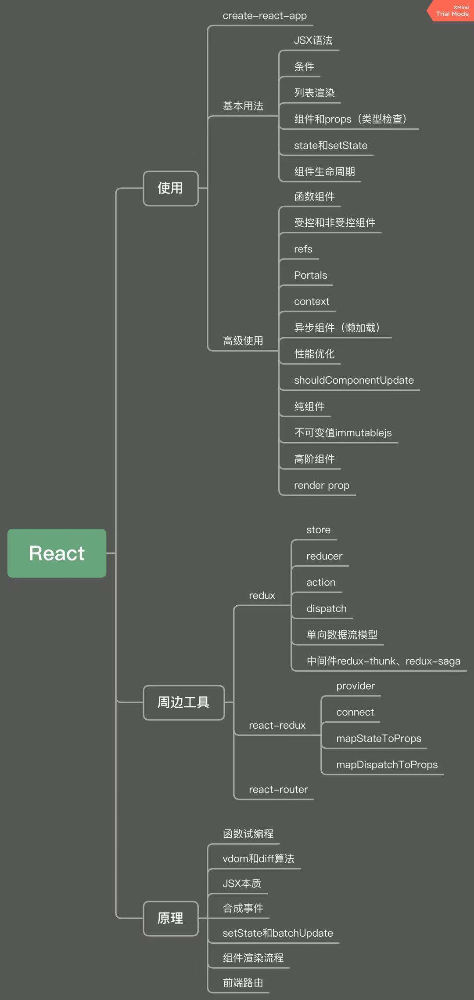

# React 基础使用
> react-demo
- 基本使用 -- 常用，必须会
- 高级特性 -- 不常用，但体现深度
- Redux 和 React-router 使用

## JSX 基本使用
> react-demo/src/components/baseUse/JSXBaseDemo.js
- 变量、表达式
- class style
- 子元素和组件

## 条件判断
> react-demo/src/components/baseUse/ConditionDemo.js
- if else
- 三元表达式
- 逻辑运算符 && ||

## 渲染列表
> react-demo/src/components/baseUse/ListDemo.js
- map
- key

## 事件
> react-demo/src/components/baseUse/EventDemo.js
- bind this
- 关于 event 参数
- 传递自定义参数

## 表单
> react-demo/src/components/baseUse/FormDemo.js
- 受控组件
- input textarea select 用value
- checkbox radio用 checked

## 组件使用(父子组件通信)
> react-demo/src/components/baseUse/PropsDemo.js
- props 传递数据
- props 传递函数
- props 类型检查

# setState(重中之重)
> react-demo/src/components/baseUse/StateDemo.js
- 不可变值
- 可能是异步更新
- 可能会被合并
