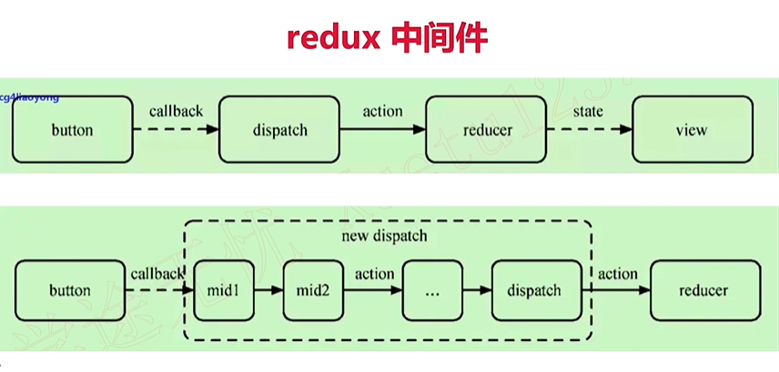

# React周边工具

## Redux 使用
- 和 Vuex 作用相同，但比Vuex学习成本高
- 不可变值，纯函数
- 常考

### 基本概念
- store state
- action
- reducer

### 单向数据流
- dispatch（action）
- reducer -> newState
- subscribe 触发通知

### react-redux
- <Provider> connect
- connect
- mapStateToProps mapDispatchToProps

### 异步action
```javascript
// 同步 action
export const addTodo = text => {
    // 返回 action 对象
    return {
        type: 'ADD_TODO',
        id: nextTodoId++.
        text
    }
}
// 异步 action
export const addTodoAsync = text => {
    // 返回函数，其中有 dispatch 参数
    return (dispatch) => {
        // ajax 异步获取数据
        fetch(url).then(res => {
            // 执行异步 action
            dispatch(addTodo(res.text))
        })
    }
}
```
- redux-thunk
- redux-promise
- redux-saga

### 中间件


- redux 中间件 - logger 实现
```javascript
// 自己修改 dispatch, 增加 logger
let next = store.dispatch
store.dispatch = function dispatchAndLog(action) {
    console.log('dispatching', action)
    next(action)
    console.log('next state', store.getState())
}
```


# React-router 使用
- 面试考点并不多（前提是熟悉react）
- 路由模式（hash、H5 history），同vue-router
- 路由配置（动态路由、懒加载），同vue-router

## 路由模式
- hash 模式（默认）：如http://abc.com/#/user/10
- H5 history模式，如http://abc.com/user/20 （需要server端支持，因此无特殊需求可选择前者）