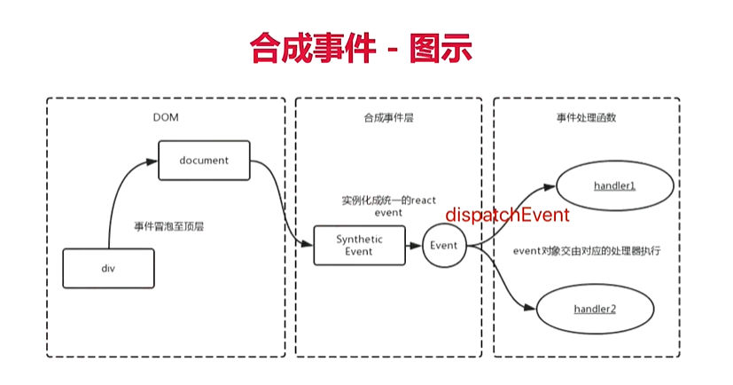
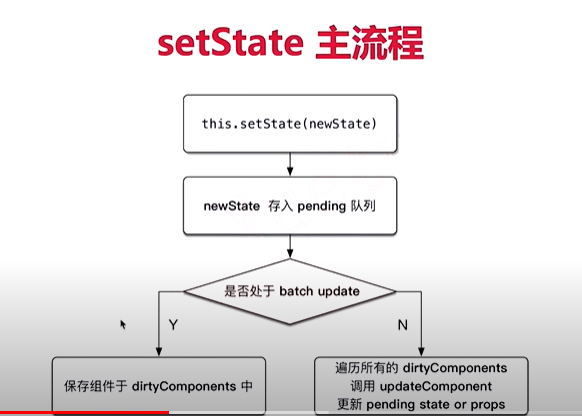
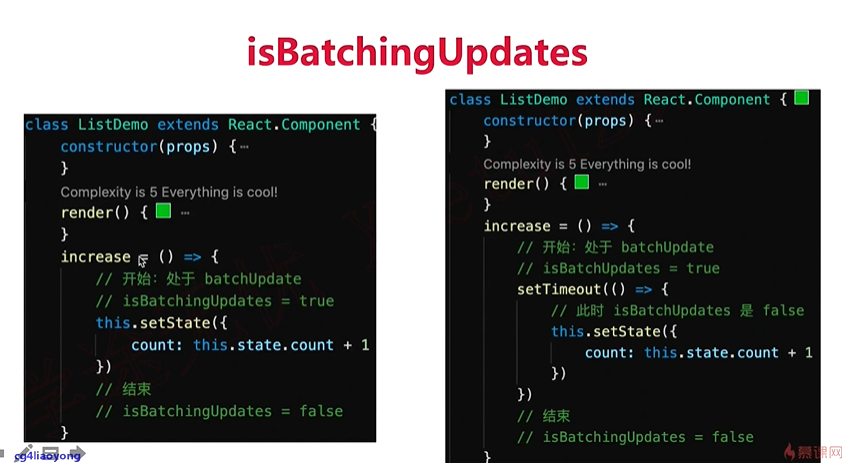
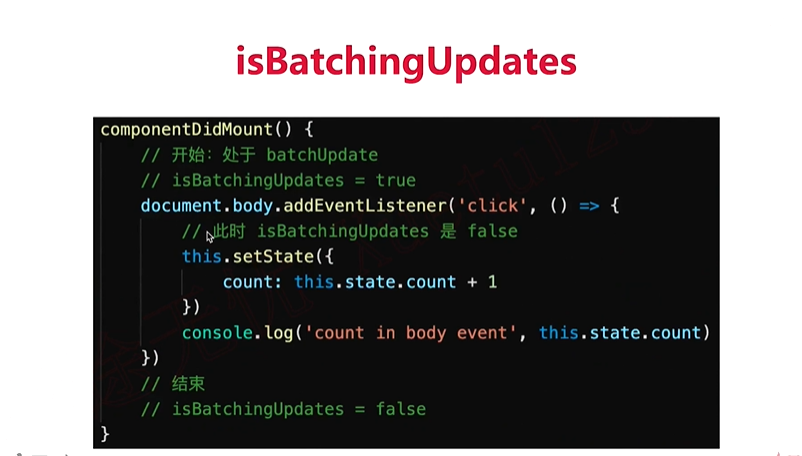

# React 原理
- 函数式编程
- vdom 和 diff
- JSX本质
- 合成事件
- setState batchUpdate
- 组件渲染过程

## 函数式编程
> 回顾 SCU 和 redux 代码
- 一种编程范式，概念比较多
- 纯函数
- 不可变值

## vdom和diff是实现React的核心技术
> react-demo/src/components/baseUse/JSXCompoiler.js

### vdom
- h 函数
- vdom 数据结构
- patch 函数

### diff
- 只比较同一层级，不跨级比较
- tag不相同，则直接删掉重建，不再深度比较
- tag 和 key，两者都相同，则认为是相同节点，不再深度比较

- Vue2.x Vue3.0 React 三者实现vdom细节都不同
- 核心概念和实现思路，都一样

## JSX 本质
> JSX 等同于 Vue 模板；Vue 模板不是html；JSX 也不是JS

- React.createElement 即 h 函数，返回vnode
- 第一个参数，可能是组件，也可能是 html tag
- 组件名，首字母必须大写（React规定）

## 合成事件
- 所有事件挂载到 document 上
- event 不是原生的，是 SyntheticEvent 合成事件对象
- 和 Vue 事件不同，和 DOM 事件也不同


### 为何要合成事件机制？
- 更好的兼容性和跨平台
- 载到 document，减少内存消耗，避免频繁解绑
- 方便事件的统一管理（如事务机制）

## setState 和 batchUpdate
- 有时异步（普通使用），有时同步（setTimeout、DOM事件）
- 有时合并（对象形式），有时不合并（函数形式）

### setState 主流程


### batchUpdate 机制



#### setState 异步还是同步？
- setState 无所谓异步还是同步
- 看是否能命中 batchUpdate 机制
- 判断 isBatchingUpdates

#### 哪些能命中 batchUpdate 机制
- 生命周期（和它调用的函数）
- React 中注册的事件（和它调用的函数）
- React 可以`"管理"`的入口

#### 哪些不能命中 batchUpdate 机制
- setTimeout setInterval等（和它调用的函数）
- 自定义的 DOM 事件（和它调用的函数）
- React “管不到” 的入口

### transaction (事务)机制
```javascript
transaction.initialize = function () {
    console.log('initialize')
}
transaction.close = function () {
    console.log('close')
}
function method() {
    console.log('abc')
}
transaction.preform(method)

// 输出 'initialize'
// 输出 'abc'
// 输出 'close'
```

## 组件渲染和更新过程
- JSX 如何渲染为页面
- setState 之后如何更新页面

### 组件渲染过程
- props state
- render() 生成 vnode
- patch(elem, vnode)

### 组件更新过程
- setState(newState) --> dirtyComponents(可能有子组件)
- render() 生成 newVnode
- patch(vnode, newVnode)

### 更新的两个阶段
- 上述的patch被拆分为两个阶段：
- reconciliation 阶段 - 执行diff算法，纯JS计算
- commit 阶段 - 将diff结果渲染到DOM

#### 可能会有性能问题（解决方案 fiber）
- JS是单线程，且和DOM渲染共用一个线程
- 当组件足够负责，组件更新时计算和渲染都压力大
- 同时再有DOM操作需求（动画、鼠标拖拽等），将卡顿

### React Fiber
- 将 reconciliation 阶段进行任务拆分（commit无法拆分）
- DIN需要渲染时暂停，空闲时恢复
- window.requestIdleCallback