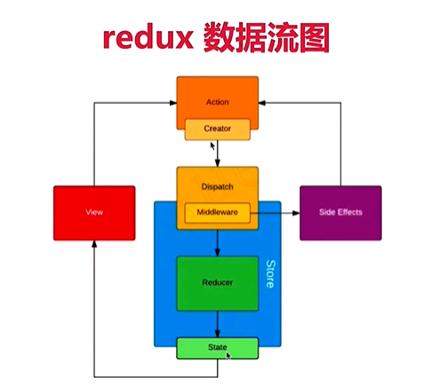

# React 真题

##### 组件之间如何通信？
- 父子组件 props
- 自定义事件
- Redux 和 Context

##### JSX本质是什么
- createElement
- 执行返回vnode

##### Context 是什么，如何应用
- 父组件，向其下所有子孙组件传递信息
- 如一些简单的公共信息：主题色、语言等
- 复杂的公共信息，请用redux

##### shouldComponentUpdate 用途
- 性能优化
- 配合 “不可变值”一起使用，否则可能出错

##### redux 单向数据流

##### setState场景题

##### 什么是纯函数
- 返回一个新值，没有副作用（不会偷偷修改其他值）
- 重点：不可变值
- 如： arr1 = arr.slice()

##### React 组件生命周期
- 单组件生命周期
- 父子组件生命周期
- 注意SCU

##### React 发起ajax应该在哪个生命周期
- componentDidMount

##### 渲染列表，为何使用key
- 必须要用key，且不能是index和random
- diff 算法中通过 tag 和 key 来判断，是否是sameNode
- 减少渲染次数，提升渲染性能

##### 函数组件和class 组件区别
- 纯函数，输入props,输出JSX
- 没有实例，没有生命周期，没有state
- 不能拓展其他方法

##### 什么是受控组件？
- 表单的值，收state控制
- 需要自行监听onChange，更新state
- 对比非受控组件

##### 何时使用异步组件？
- 同 Vue
- 加载大组件
- 路由懒加载

##### 多个组件有公共逻辑，如何抽离
- 高阶组件HOC
- Render Props
- mixin 已被 React 废弃

##### redux 如何进行异步请求
- 使用异步action
- 如 redux-thunk

##### react-router 如何配置懒加载

##### PureComponent 有何区别
- 实现了浅比较 shouldComponentUpdate
- 优化性能
- 但要结合不可变值使用

##### React 事件和DOM 事件的区别
- 所有事件挂载到document上
- event 不是原生的，是SyntheticEvent 合成事件对象
- dispatchEvent

##### React 性能优化
- 渲染列表时加 key
- 自定义事件、DOM事件及时销毁
- 合理使用异步组件
- 减少函数bind this 的次数
- 合理使用SCU PureComponent 和 memo
- 合理使用Immutable.js
- webpack 层面的优化
- 前端通用的性能优化，如图片懒加载
- 使用SSR

##### React 和 Vue 的区别
- 都支持组件化
- 都是数据驱动视图
- 都使用 vdom操作DOM

- React 使用JSX拥抱JS，Vue使用模板拥抱html
- React 函数式编程，Vue声明式编程
- React 更多需要自力更生，Vue把想要的都给你