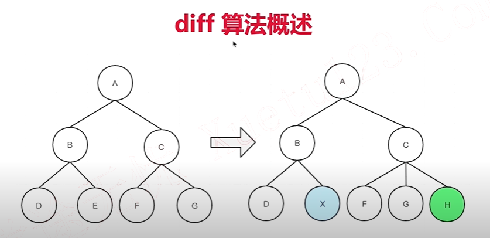
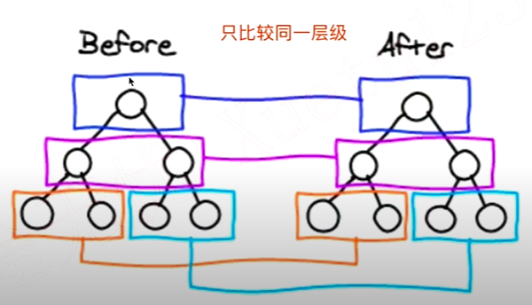
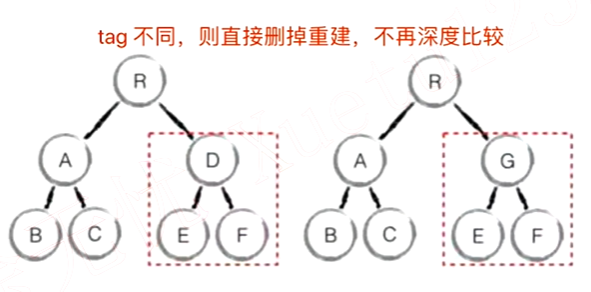

# Vue 原理 (大厂必考)
### 面试为何考察原理？
- 知其然知其所以然--各行业通用的道理
- 了解原理，才能应用的更好（竞争激烈，择优录取）
- 大厂造轮子（有钱有资源，业务定制，技术KPI）

### 面试中如何考察？以何种方式？
- 考察重点，而不是考察细节。掌握好 2/8 原则
- 和使用相关联的原理，例如：vdom、模板渲染
- 整体流程是否全面？热门技术是否有深度？

### Vue 原理包括哪些？
- 组件化和MVVM
- 响应式原理
- vdom 和 diff 原理
- 模板编译
- 组件渲染过程
- 前端路由

## 组件化基础
- "很久以前" 就有组件化
- 数据驱动视图(MVVM, setState)

### "很久以前" 就有组件化
- asp jsp php 已经有组件化
- nodejs 也有类似的组件化
- 模板语言

### 数据驱动视图
- 传统组件，只是静态渲染，更新还要依赖于操作DOM
- 数据驱动视图 - Vue MVVM
- 数据驱动视图 - React setState

### MVVM


## Vue 响应式
- 组件 data 的数据一旦变化，立刻触发视图的更新
- 实现数据驱动视图的第一步
- 考察 Vue 原理的第一题
- 核心API - Object.defineProperty
- 如何实现响应式，代码演示
- Object.defineProperty 的一些缺点 （Vue3.0 启用 Proxy ）

### Proxy 有兼容性问题
- Proxy 兼容性不好，且无法polyfill
- Vue2.x 还会存在一段时间，所以都得学

### Object.defineProperty 基本用法
```javascript
const data = {}
let name = 'leslie'
Object.defineProperty(data, "name", {
    get: function() {
        console.log('get')
        return name
    },
    set: function(newVal) {
        console.log('set')
        name = newVal
    }
})
// 测试
console.log(data.name)
data.name = 'lisi'
```

### Object.defineProperty 实现响应式
> observe-demo

- 监听对象，监听数组
- 复杂对象，深度监听
- 几个缺点

#### Object.defineProperty 缺点
- 深度监听，需要递归到底，一次性计算量大
- 无法监听新增/删除属性（Vue.set Vue.delete）
- 无法监听原生数组，需要特殊处理

## 虚拟 DOM（Virtual DOM）和 diff
- vdom 是实现 vue 和 React 的重要基石
- diff 算法是 vdom 中最核心、最关键的部分
- vdom 是一个热门话题，也是面试中的热门问题

- DOM 操作非常耗费性能
- 以前用JQuery，可以自行控制 DOM 操作的时机，手动调整
- Vue 和 React 是数据驱动视图，如何有效控制 DOM 操作？

### 解决方案 - vdom
- 有了一定复杂度，想减少计算次数比较难
- 能不能把计算，更多的转移为JS计算？因为JS执行速度很快
- vdom - 用JS模拟DOM结构，计算出最小的变更，操作DOM

### 用 JS 模拟DOM 结构
```html
<div id="div1" class="container">
    <p>vdom</p>
    <ul style="font-size: 20px">
        <li>a</li>
    </ul>
</div>
```
```javascript
{
    tag: 'div',
    props: {
        className: 'container',
        id: 'div1'
    },
    children: [
        {
            tag: 'p',
            children: 'vdom'
        },
        {
            tag: 'ul',
            props: { style: 'font-size: 20px'},
            children: [
                {
                    tag: 'li',
                    children: 'a'
                }
                // ...
            ]
        }
    ]
}
```

### 通过 snabbdom 学习 vdom
- 简洁强大的 vdom 库，易学易用
- Vue 参考它实现的 vdom 和 diff
- https://github.com/snabbdom/snabbdom
- Vue3.0 重写了 vdom 的代码，优化了性能
- 但 vdom 的基本理念不变，面试考点也不变
- React vdom 具体实现和 Vue 也不同，但不妨碍统一学习

### diff 算法
- diff 算法是 vdom 中最核心、最关键的部分
- diff 算法能在日常使用vue react 中体现出来（如key）
- diff 算法是前端热门话题，面试“宠儿”

### diff 算法概述
- diff 即对比，是一个广泛的概念，如linux diff命令、git diff等
- 两个js 对象也可以做diff
- 两棵树做diff，如这里的 vdom diff



### 树 diff 的时间复杂度 O(n^3)
- 第一，遍历tree1；第二，遍历tree2
- 第三，排序
- 1000 个节点，要计算1亿次，算法不可用

### 优化时间复杂度到O(n)
- 只比较同一层级，不跨级比较

- tag不相同，则直接删掉重建，不再深度比较

- tag 和 key，两者都相同，则认为是相同节点，不再深度比较
